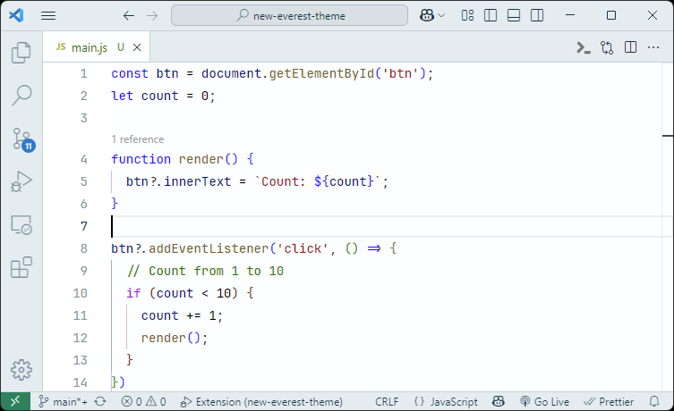

# New Everest Theme

This extension for Visual Studio Code adds themes titled "New Everest".

## Description

Inspired by the majestic heights and serene landscapes of Mount Everest, this light theme aims to provide a calming and
focused coding environment. The soft blues and grays mimic the icy terrains, while subtle hints of warmer colors evoke
the golden hues of dawn breaking over snow-capped peaks.

## Changelog

See [CHANGELOG.md](./CHANGELOG.md)

## Screenshot

## Credits

- Application color scheme from [Everest](https://plugins.jetbrains.com/plugin/22653-everest-theme), a Jetbrains Theme designed by Codigrate:

<a href="https://github.com/furknyavuz"> Furkan Yavuz</a>

<a href="https://github.com/kerimalp"> Kerim Alp Kaya</a>

- Syntax hightlight from [Visual Studio Blue Theme](https://marketplace.visualstudio.com/items?itemName=DanijelMalinovic.visual-studio-blue-theme), made by Danijel Malinovic

**Enjoy!**
